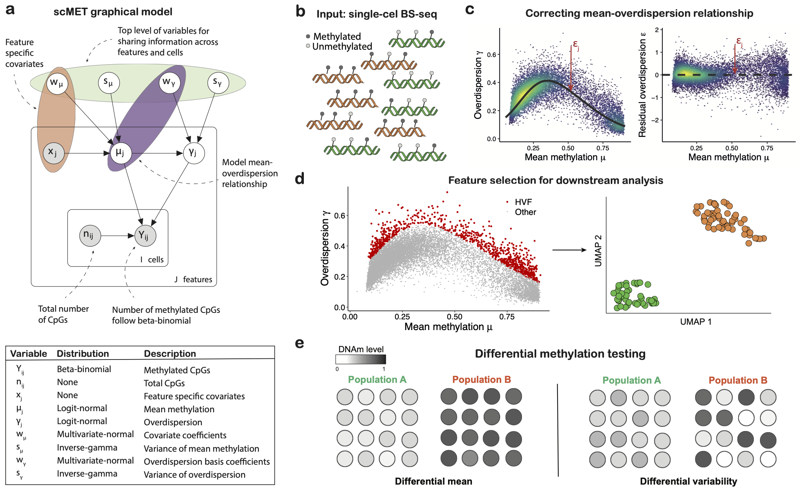

# scMET
Bayesian modelling of DNA methylation heterogeneity at single-cell resolution

## Background
High throughput measurements of DNA methylomes at single-cell resolution are a promising resource to quantify the heterogeneity of DNA methylation and uncover its role in gene regulation. However, limitations of the technology result in sparse CpG coverage, effectively posing challenges to robustly quantify genuine DNA methylation heterogeneity. Here we introduce __scMET__, a Bayesian framework for the analysis of single cell DNA methylation data. This modelling approach combines a hierarchical beta-binomial specification with a generalised linear model framework with the aim of capturing biological overdispersion and overcome data sparsity by sharing information across cells and genomic features.

To disentangle technical from biological variability and overcome data sparsity, scMET couples a hierarchical BB model with a GLM framework (Fig.1a-b). For each cell $i$ and region $j$, the input for scMET is the number of CpG sites that are observed to be methylated ($Y_{ij}$) and the total number of sites for which methylation status was recorded ($n_{ij}$). The BB model uses feature-specific mean parameters $\mu_j$ to quantify overall DNAm across all cells and biological _overdispersion_ parameters $\gamma_j$ as a proxy for cell-to-cell DNAm heterogeneity. These parameters capture the amount of variability that is not explained by binomial sampling noise, which would only account for technical variation.

The GLM framework is incorporated at two levels. Firstly, to introduce feature-specific covariates $\mathbf{x}_{j}$ (e.g. CpG density) that may explain differences in mean methylation $\mu_j$ across features. Secondly, similar to [Eling2018](https://pubmed.ncbi.nlm.nih.gov/30172840/), we use a non-linear regression framework to capture the mean-overdispersion trend that is typically observed in high throughput sequencing data, such as scBS-seq (Fig.1c). This trend is used to derive _residual overdispersion_ parameters $\epsilon_j$ --- a measure of cell-to-cell variability that is not confounded by mean methylation. Feature-specific parameters are subsequently used for: (i) feature selection, to identify highly variable features (HVFs) that drive cell-to-cell epigenetic heterogeneity (Fig.1d) and (ii) differential methylation testing, to highlight features that show differences in DNAm mean or variability between specified groups of cells (Fig.1e). 

 

Overview of the `scMET` model is shown below:


## Installation
```R
# install.packages("devtools")
devtools::install_github("andreaskapou/scMET")
```

## Online vignette
scMET is not yet part of the Bioconductor. Until then, an online vigenette can be found in
[https://rpubs.com/cakapourani/scmet-analysis](https://rpubs.com/cakapourani/scmet-analysis).


