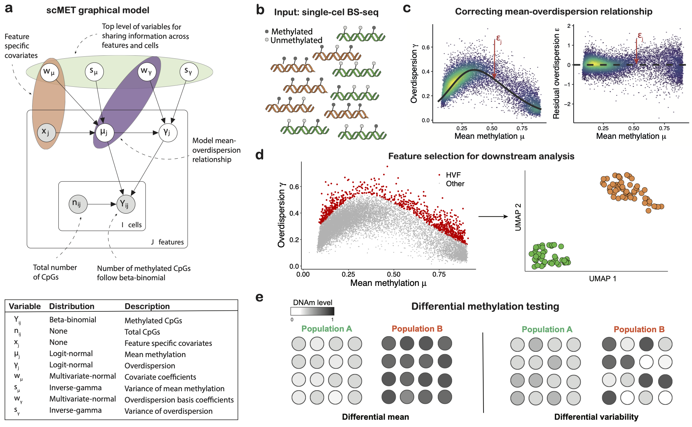

```{r style, echo=FALSE, results='hide', message=FALSE}
library(BiocStyle)
library(knitr)
opts_chunk$set(error = FALSE, message = TRUE, warning = FALSE)
#opts_chunk$set(fig.asp = 1)
```

 
# Introduction
High throughput measurements of DNA methylomes at single-cell resolution are a promising resource to quantify the heterogeneity of DNA methylation and uncover its role in gene regulation. However, limitations of the technology result in sparse CpG coverage, effectively posing challenges to robustly quantify genuine DNA methylation heterogeneity. Here we introduce __scMET__, a Bayesian framework for the analysis of single-cell DNA methylation data. This modelling approach combines a hierarchical beta-binomial specification with a generalised linear model framework with the aim of capturing biological overdispersion and overcome data sparsity by sharing information across cells and genomic features.

To disentangle technical from biological variability and overcome data sparsity, scMET couples a hierarchical BB model with a GLM framework (Fig.\@ref(fig:scmet)a-b). For each cell $i$ and region $j$, the input for scMET is the number of CpG sites that are observed to be methylated ($Y_{ij}$) and the total number of sites for which methylation status was recorded ($n_{ij}$). The BB model uses feature-specific mean parameters $\mu_j$ to quantify overall DNAm across all cells and biological _overdispersion_ parameters $\gamma_j$ as a proxy for cell-to-cell DNAm heterogeneity. These parameters capture the amount of variability that is not explained by binomial sampling noise, which would only account for technical variation.

The GLM framework is incorporated at two levels. Firstly, to introduce feature-specific covariates $\mathbf{x}_{j}$ (e.g. CpG density) that may explain differences in mean methylation $\mu_j$ across features. Secondly, similar to [Eling2018](https://pubmed.ncbi.nlm.nih.gov/30172840/), we use a non-linear regression framework to capture the mean-overdispersion trend that is typically observed in high throughput sequencing data, such as scBS-seq (Fig.\@ref(fig:scmet)c). This trend is used to derive _residual overdispersion_ parameters $\epsilon_j$ --- a measure of cell-to-cell variability that is not confounded by mean methylation. Feature-specific parameters are subsequently used for: (i) feature selection, to identify highly variable features (HVFs) that drive cell-to-cell epigenetic heterogeneity (Fig.\@ref(fig:scmet)d) and (ii) differential methylation testing, to highlight features that show differences in DNAm mean or variability between specified groups of cells (Fig.\@ref(fig:scmet)e). 

```{r scmet, fig.retina = NULL, fig.align='center', fig.wide = TRUE, fig.cap="`scMET` model overview.", echo=FALSE}

```


# Installation
```{r installation, echo=TRUE, eval=FALSE}
# Install stable version from Bioconductor
if (!require("BiocManager", quietly = TRUE))
    install.packages("BiocManager")

BiocManager::install("scMET")

## Or development version from Github
# install.packages("remotes")
remotes::install_github("andreaskapou/scMET")
```


# scMET analysis on synthetic data
To highlight the main functionality of `scMET` we first apply it on synthetic data, where we can assess the accuracy of the inferred parameters ($\mu$ and $\gamma$) as well as compare it with the maximum likelihood estimation of simple beta-binomial (BB-MLE) model. 

```{r load_package}
# Load package
suppressPackageStartupMessages(library(scMET))
suppressPackageStartupMessages(library(data.table))
set.seed(123)
```

## Loading synthetic data
scMET comes with simulated scBS-seq data from a single population. The users can generate their own synthetic data using the `scmet_simulate` function. __NOTE__ For interoperability of scMET and `SingleCellExperiment` objects see last section of this vignette.

```{r load_data}
# Synthetic data: list with following elements
names(scmet_dt)
```

Here, `Y` is a `data.table` containing the scBS-seq data in long format, where `total_reads` corresponds to the total number of covered CpGs $n_{ij}$ and `met_reads` to number of methylated CpGs $Y_{ij}$ in cell $i$ and feature $j$ (see Fig.\@ref(fig:scmet)). This is the data __format__ that scMET requires as input.
```{r}
head(scmet_dt$Y)
```

Next, `X` is a matrix containing the feature-specific covariates that might explain differences in mean methylation. The first column of X is the bias term and contains a vector of 1s. This is an __optional__ input when performing inference using scMET.
```{r}
head(scmet_dt$X)
```
 
The `theta_true` element just contains the true $\mu$ and $\gamma$ parameters used to generate the scBS-seq data `Y`. We will use these to assess our prediction performance later. Finally the `theta_priors_true` contains the prior hyper-parameters which we defined to generate the synthetic data (top level parameters in Fig.\@ref(fig:scmet)).
```{r}
# Parameters \mu and \gamma
head(scmet_dt$theta_true)
# Hyper-paramter values
scmet_dt$theta_priors_true
```

Now let's visualise how the mean-overdispersion trend looks like in our synthetic data and also the association between mean methylation and covariates `X`, which here we will assume is CpG density.
```{r plot_synthetic, fig.wide = TRUE}
par(mfrow = c(1,2))
plot(scmet_dt$theta_true$mu, scmet_dt$theta_true$gamma, pch = 20,
     xlab = expression(paste("Mean methylation ",  mu)), 
     ylab = expression(paste("Overdsispersion ",  gamma)))
plot(scmet_dt$X[,2], scmet_dt$theta_true$mu, pch = 20,
     xlab = "X: CpG density", 
     ylab = expression(paste("Mean methylation ",  mu)))
```

## scMET inference 
Now we can perform inference on the simulated data using the `scmet` function. In addition to providing the input data `Y` and covariates `X`, we set `L = 4` radial basis functions to model the mean-overdispersion relationship. Also, we set the total number of VB iterations to `iter = 500` for efficiency purposes (hence the model will most probably not converge and which can be seen by the fitted lines being further away than expected). We let all the other parameters as default.

__NOTE 1__ The user should set this to a much higher value, e.g. around 20,000 when running VB so the model converges.

__NOTE 2__ For relatively small datasets we recommend using the MCMC implementation of scMET, i.e. setting `use_mcmc = TRUE`, since it is more stable than the VB approximation and gives more accurate results.

```{r run_scmet_synthetic, warning=FALSE, message=FALSE}
# Run with seed for reproducibility
fit_obj <- scmet(Y = scmet_dt$Y, X = scmet_dt$X, L = 4,
                 iter = 1000, seed = 12)
```


### Output summary
The `scmet` returns a `scmet_<mode>` object (mode either `vb` or `mcmc`) with the following structure:
```{r}
class(fit_obj)
names(fit_obj)
```
Here the most important entry is the `posterior` entry, which is a list containing the posterior draws for each of the model parameters. All other elements contain the input data and initialised hyper-parameter values for reproducibility purposes. 
```{r}
# Elements of the posterior list
names(fit_obj$posterior)
# Rows correspond to draws and columns to parameter dimensions
# here number of features.
dim(fit_obj$posterior$mu)
# First 5 draws across 3 features for \mu parameter
fit_obj$posterior$mu[1:5, 1:3]
# First 5 draws across 3 features for \gamma parameter
fit_obj$posterior$gamma[1:5, 1:3]
# First 5 draws for covariate coefficients
# number of columns equal to ncol(X) = 2
fit_obj$posterior$w_mu[1:5, ]

# First 5 draws for RBF coefficients
# number of columns equal to L = 4
fit_obj$posterior$w_gamma[1:5, ]
```

## Plotting mean-overdispersion relationship 
Next we plot the posterior median parameter estimates of $\mu$ and $\gamma$ together with the fitted non-linear trend. The color code is used to represent areas with high (green and yellow) and low (blue) concentration of features via kernel density estimation. Mostly useful when visualising datasets with large number of features.
```{r mean_var_plot1, fig.wide = TRUE}
gg1 <- scmet_plot_mean_var(obj = fit_obj, y = "gamma", 
                           task = NULL, show_fit = TRUE)
gg2 <- scmet_plot_mean_var(obj = fit_obj, y = "epsilon", 
                           task = NULL, show_fit = TRUE)
cowplot::plot_grid(gg1, gg2, ncol = 2)
```

As expected we observe no association between the mean - residual overdisperion relatioship.


## Comparing true versus estimated parameters
Next we assess the predictive performance of scMET by comparing the posterior estimates with the true parameter values used to generate the synthetic data.
```{r, fig.wide = TRUE, warning=FALSE, message=FALSE}
# Mean methylation estimates
gg1 <- scmet_plot_estimated_vs_true(obj = fit_obj, sim_dt = scmet_dt, 
                                    param = "mu")
# Overdispersion estimates
gg2 <- scmet_plot_estimated_vs_true(obj = fit_obj, sim_dt = scmet_dt, 
                                    param = "gamma")
cowplot::plot_grid(gg1, gg2, ncol = 2)
```

### scMET versus beta-binomial MLE (shrinkage)
Below we assess the predictive performance of scMET compared to the maximum likelihood estimates from a beta-binomial model. First we obtain MLE estimates:
```{r, warning=FALSE, message=FALSE}
# Obtain MLE estimates by calling the bb_mle function
bbmle_fit <- scmet_dt$Y[, bb_mle(cbind(total_reads, met_reads)), 
                        by = c("Feature")]
bbmle_fit <- bbmle_fit[, c("Feature", "mu", "gamma")]
head(bbmle_fit)
```

As we can see, scMET can more accurately estimate the overdispersion parameter $\gamma$ by shrinking the MLE estimates towards to population average, resulting in more robust estimates.
```{r, fig.width=6, fig.height=4, fig.wide = TRUE, warning=FALSE, message=FALSE}
# Overdispersion estimates MLE vs scMET
# subset of features to avoid over-plotting
scmet_plot_estimated_vs_true(obj = fit_obj, sim_dt = scmet_dt, 
                             param = "gamma", mle_fit = bbmle_fit)
```

The above sections mostly focused on assessing the prediction performance of scMET. Below we show how the user can use scMET for downstream analyses, such as feature selection and differential methylation testing.

## Identifying highly variable features
After fitting the scMET model, we now show how to perform feature selection; that is to identify highly variable features (HVF) which potentially drive cell-to-cell DNA methylation heterogeneity. We will identify HVFs based on the residual overdispersion estimates $\epsilon$ (This is the default and recommended approach of scMET. The user can also perform HVF analysis based on the overdispersion parameter $\gamma$, which however will be confounded by the mean methylation levels).
 
We can perform HVF analysis simply by calling the `scmet_hvf` function. This will create a new list named `hvf` within the `fit_obj` object.
```{r, warning=FALSE}
# Run HVF analysis
fit_obj <- scmet_hvf(scmet_obj = fit_obj, delta_e = 0.75, 
                     evidence_thresh = 0.8, efdr = 0.1)

# Summary of HVF analysis
head(fit_obj$hvf$summary)
```

Here the `tail_prob` column denotes the evidence our model provides of a feature being called as HVF (the higher the larger the evidence), and the `is_variable` column denotes the output whether the feature was called as HVF or not.

Below we show the grid search to obtain the optimal posterior evidence threshold to achieve EFDR = 10%.
```{r, fig.width=6, fig.height=3, fig.wide = TRUE}
scmet_plot_efdr_efnr_grid(obj = fit_obj, task = "hvf")
```

Next we can also plot the corresponding __tail posterior probabilities__ as a function of $\mu$ and plot the mean - overdispersion relationship coloured by the HVF analysis.
```{r, fig.height=4, fig.width=9, fig.wide = TRUE}
gg1 <- scmet_plot_vf_tail_prob(obj = fit_obj, x = "mu", task = "hvf")
gg2 <- scmet_plot_mean_var(obj = fit_obj, y = "gamma", task = "hvf")
cowplot::plot_grid(gg1, gg2, ncol = 2)
```

__NOTE__ One could perform the exact analysis for identifying lowly variable features (LVFs), although in general these are less useful for downstream analysis, such as clustering, since they denote regulatory regions that have stable DNAm patterns across cells.

## Differential analysis with scMET
scMET has additional functionality for calling differentially methylated (__DM__) and differentially variable (__DV__) features when analysing cells from two conditions/populations.

To perform differential testing, scMET contains simulated data from two conditions/groups of cells, where a subset of features are DM and some others are DV between groups __A__ and __B__. The user can generate their own synthetic data using the `scmet_simulate_diff` function. Below we show the structure of the `scmet_diff_dt` object.
```{r load_diff_data}
# Structure of simulated data from two populations
names(scmet_diff_dt)
```

Below we plot the mean-overdispersion relationship of the _true_ parameters for each group, and highlight with red colour the features that are truly __differentially variable__ in group B compared to group A. 
```{r, fig.wide = TRUE}
# Extract DV features
dv <- scmet_diff_dt$diff_var_features$feature_idx
# Parameters for each group
theta_A <- scmet_diff_dt$scmet_dt_A$theta_true
theta_B <- scmet_diff_dt$scmet_dt_B$theta_true

par(mfrow = c(1,2))
# Group A mean - overdispersion relationship
plot(theta_A$mu, theta_A$gamma, pch = 20, main = "Group A",
     xlab = expression(paste("Mean methylation ",  mu)), 
     ylab = expression(paste("Overdsispersion ",  gamma)))
points(theta_A$mu[dv], theta_A$gamma[dv], col = "red", pch = 20)

# Group B mean - overdispersion relationship
plot(theta_B$mu, theta_B$gamma, pch = 20, main = "Group B",
     xlab = expression(paste("Mean methylation ",  mu)), 
     ylab = expression(paste("Overdsispersion ",  gamma)))
points(theta_B$mu[dv], theta_B$gamma[dv], col = "red", pch = 20)
```


The `scmet_dt_A` and `scmet_dt_B` are the two simulated datasets, having the same structure as the `scmet_dt` object in the above sections. The additional elements contain information about which features are DM or DV across populations.

### Fitting scMET for each group
To perform differential analysis, we first need to run the `scmet` function on each dataset/group independently.

__NOTE 1__ The user should set this to a much higher value, e.g. around 20,000 when running VB.

__NOTE 2__ For relatively small datasets we recommend using the MCMC implementation of scMET, i.e. setting `use_mcmc = TRUE`, since it is more stable than the VB approximation and generally gives more accurate results.
```{r, warning = FALSE, message = FALSE}
# Run scMET for group A
fit_A <- scmet(Y = scmet_diff_dt$scmet_dt_A$Y,
               X = scmet_diff_dt$scmet_dt_A$X, L = 4, 
               iter = 300, seed = 12)
# Run scMET for group B
fit_B <- scmet(Y = scmet_diff_dt$scmet_dt_B$Y,
               X = scmet_diff_dt$scmet_dt_B$X, L = 4, 
               iter = 300, seed = 12)
```

Showing mean - overdispersion plots for each group
```{r, fig.wide = TRUE}
gg1 <- scmet_plot_mean_var(obj = fit_A, y = "gamma", task = NULL, 
                           title = "Group A")
gg2 <- scmet_plot_mean_var(obj = fit_B, y = "gamma", task = NULL, 
                           title = "Group B")
cowplot::plot_grid(gg1, gg2, ncol = 2)
```

### Running differential analysis
Now we can perform the DM and DV analysis by calling the `scmet_differential` function. __NOTE__ that only those features that are common across the two groups will be kept for this analysis.
```{r}
# Run differential analysis with small evidence_thresh
# tp obtain more hits.
diff_obj <- scmet_differential(obj_A = fit_A, obj_B = fit_B,
                               evidence_thresh_m = 0.65,
                               evidence_thresh_e = 0.65,
                               group_label_A = "A",
                               group_label_B = "B")
```

__NOTE__ sometimes the method returns a message that it could not obtain an acceptable evidence threshold to achieve EFDR = 5%. Then by by default the evidence threshold is set to the initial value. This does __not__ mean though that the test failed. 

The `diff_obj` stores all the differential analysis information in the following structure:
```{r}
# Structure of diff_obj
class(diff_obj)
names(diff_obj)
```

The `diff_<mode>_summary` entries contain the summary of the differential analysis, whereas the `diff_<mode>_thresh` slots contain information about the optimal posterior evidence threshold search to achieve the required EFDR.
```{r}
# DM results
head(diff_obj$diff_mu_summary)
# Summary of DMs
diff_obj$diff_mu_summary |> 
        dplyr::count(mu_diff_test)
# DV (based on epsilon) results
head(diff_obj$diff_epsilon_summary)
# Summary of DVs
diff_obj$diff_epsilon_summary |> 
  dplyr::count(epsilon_diff_test)
```


Let us plot first the grid search for optimal evidence threshold.
```{r, fig.width=10, fig.height=3.5, fig.wide = TRUE}
gg1 <- scmet_plot_efdr_efnr_grid(obj = diff_obj, task = "diff_mu")
gg2 <- scmet_plot_efdr_efnr_grid(obj = diff_obj, task = "diff_epsilon")
cowplot::plot_grid(gg1, gg2, ncol = 2)
```

### Plotting differential hits
Below we show volcano plots for DM and DV analysis. Red and green colours correspond to features that are more methylated or variable in group A and group B, respectively.
```{r, fig.width=6, fig.height=4, fig.wide = TRUE}
# DM volcano plot
scmet_plot_volcano(diff_obj, task = "diff_mu")
# DV based on epsilon volcano plot
scmet_plot_volcano(diff_obj, task = "diff_epsilon")
```


Below we show MA plots for DM and DV analysis.
```{r, fig.width=10, fig.height=4, fig.wide = TRUE}
# MA plot for DM analysis and x axis overall mean methylation
gg1 <- scmet_plot_ma(diff_obj, task = "diff_mu", x = "mu")
# MA plot for DV analysis and x axis overall mean methylation
gg2 <- scmet_plot_ma(diff_obj, task = "diff_epsilon", x = "mu")
cowplot::plot_grid(gg1, gg2, ncol = 2)
```

# Interoperability between scMET and the SingleCellExperiment class
In this section we show the ability to convert between scMET objects and `SingleCellExperiment` (SCE) objects.

`SingleCellExperiment` is a class for storing single-cell experiment data used by many Bioconductor analysis packages. To the best of our knowledge there is no standard format for storing scBS-seq data. However, to ease analysis pipeline with scMET for users with experience in Bioconductor we provide helper functions for converting between those formats. 

The structure of the SCE object to store scBS-seq data is as follows. We create two assays, `met` storing methylated CpGs and `total` storing total number of CpGs. Rows correspond to features and columns to cells, similar to scRNA-seq convention. To distinguish between a feature (in a cell) having zero methylated CpGs vs not having CpG coverage at all (missing value), we check if the corresponding entry in `total` is zero as well. Next `rownames` and `colnames` should store the feature and cell names, respectively. Covariates `X` that might explain variability in mean (methylation) should be stored in `metadata(rowData(sce))$X`.

Below we show an example of converting between these formats.

```{r}
Y_scmet <- scmet_dt$Y # Methylation data
X <- scmet_dt$X # Covariates
head(Y_scmet)
```

Convert from scMET to SCE object:
```{r}
# We could set X = NULL if we do not have covariates
Y_sce <- scmet_to_sce(Y = Y_scmet, X = X)
Y_sce
```

Next, we convert back to scMET object:
```{r}
scmet_obj <- sce_to_scmet(sce = Y_sce)
head(scmet_obj$Y)
```

Finally we can check that the final object is the same as our initial one:
```{r}
all(Y_scmet == scmet_obj$Y)
```


# Session Info
This vignette was compiled using:
```{r session_info, echo=TRUE, message=FALSE}
sessionInfo()
```

# Acknowledgements
This study was supported by funding from the University of Edinburgh and Medical Research Council (core grant to the MRC Institute of Genetics and Cancer). Many thanks to _John Riddell_ for the conversion functions.
